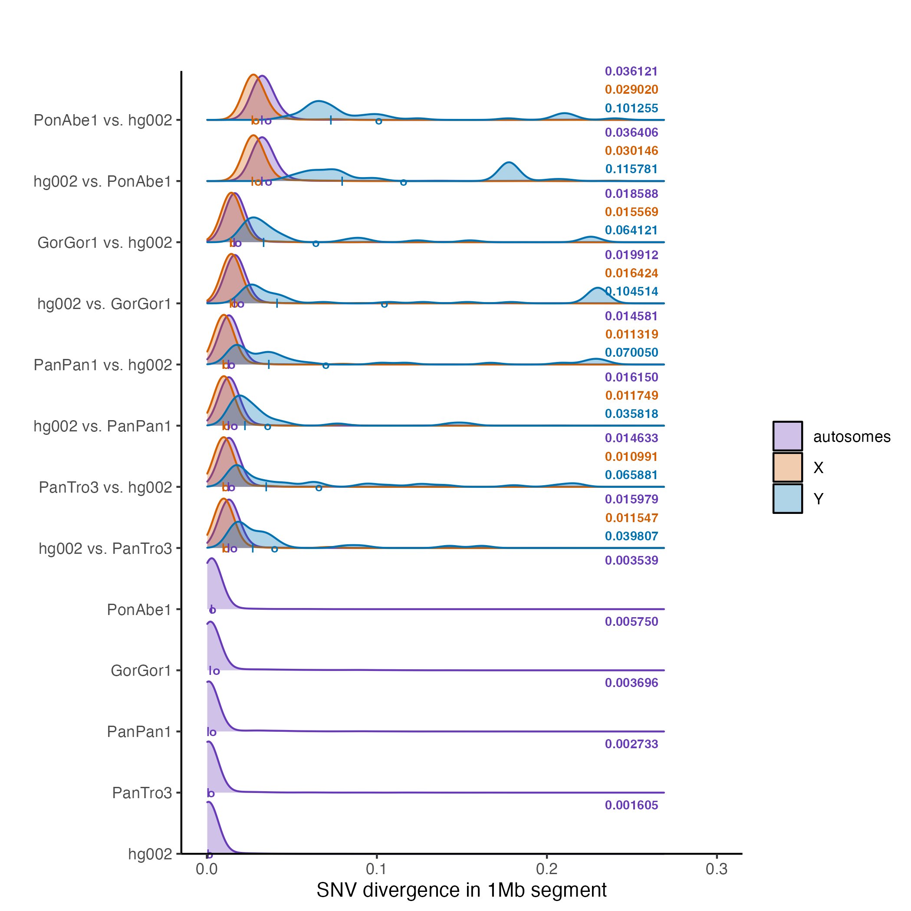
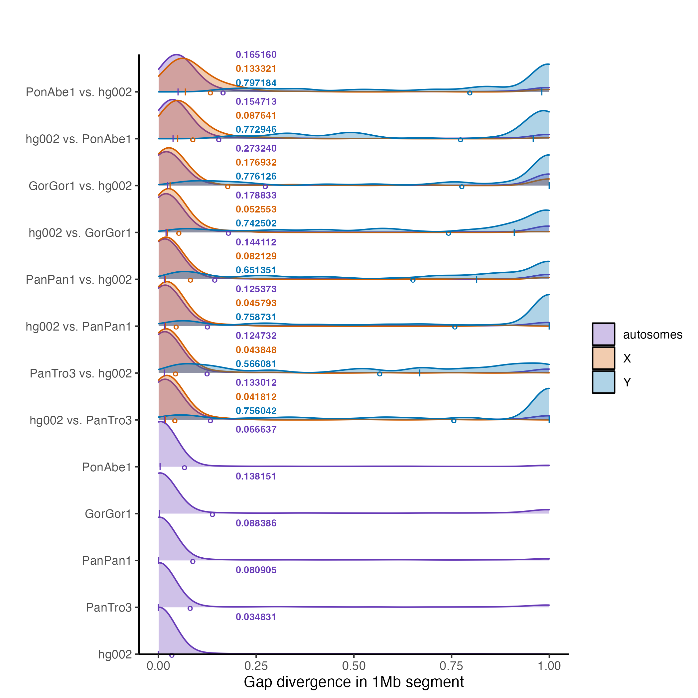
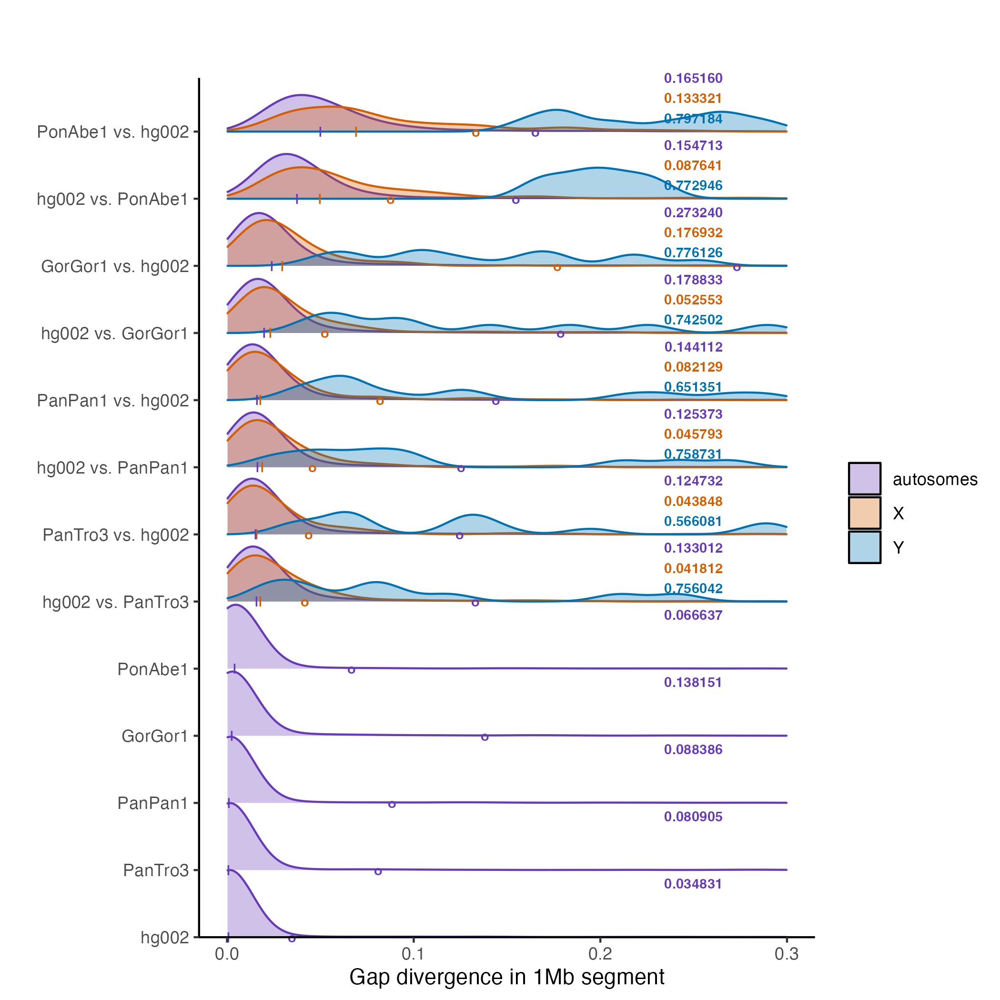

# SNV and gap divergence
------------------------

**Step 1:** Download data into directories as described [here](download.md).

**Step 2:** Submit jobs to compute basic SNV and gap divergence with [this script](basic-div/submit_basic.sh).

```
cd basic-div
bash submit_basic.sh
```

**Step 3:** Make plots
```
Rscript plot_gap_divergence.R
Rscript plot_snv_divergence.R
```

**RESULTS:** 
SNV divergence and gap divergence were computed from pairwise alignments, estimated with wfmash v 0.13, for 1MB segments across the genome. **SNV divergence** is the fraction of positions in the genome where the two haplotypes are in different nucleotide states (and neither haplotype is a gap state or a missing state). **Gap divergence** is the fraction of positions in the genome where the second haplotype is a gap state (and the first haplotype is a nucleotide state; note that the first haplotype is never in a gap state but it can be in a missing state because of masking).

The plot below shows 1MB segments are binned by **SNV divergence** separated by pairwise alignment (note that density, rather than counts, are shown).
The second haplotype listed was aligned to the first (note that "x vs. y" and "y vs. x" are different pairwise alignments because the former includes the entire x haplotype with no gaps and the latter includes the entire y haplotype with no gaps).
Density plots are broken down according to whether the segments come from an autosome, the X chromosome, or the Y chromosome. Mean SNV divergence is reported for these three cases (numeric values and circles; medians are `|` characters).


The plot below shows 1MB segments are binned by **gap divergence** separated by pairwise alignment (note that density, rather than counts, are shown; height normalizd hisograms are also shown). 
The second haplotype listed was aligned to the first (note that "x vs. y" and "y vs. x" are different pairwise alignments because the former includes the entire x haplotype with no gaps and the latter includes the entire y haplotype with no gaps).
Density plots are broken down according to whether the segments come from an autosome, the X chromosome, or the Y chromosome. Mean gap divergence is reported for these three cases (numeric values and circles; medians are `|` characters).


This plot is the same as the plot above but zoomed in.


IMPORTANT: An issue in making histograms or density plots for the Y chromosome is that there are far fewer segments than for autosomes (~30 vs ~3000 segments for autosomes). Thus, peaks could be driven by 1-2 segments for the Y chromosome.

Note that you can count the number of missing characters in the reference file in the pairwise alignment with this command. You can also check the CSV files for more information.
```
zcat <filname>.maf.gz | head -n2 > tmp.txt
tr -cd 'N' < tmp.txt | wc -c
```
