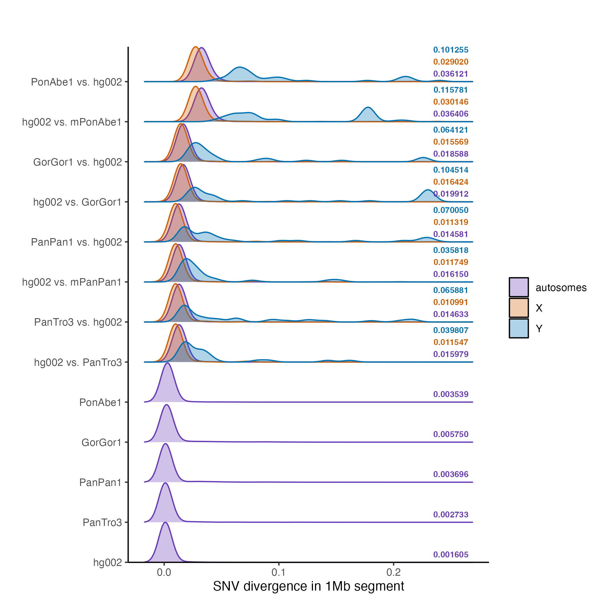

# SNV and gap divergence
------------------------

**Step 1:** Download data into directories as described [here](download.md).

**Step 2:** Submit jobs to compute basic SNV and gap divergence with [this script](basic-div/submit_basic.sh).

```
cd basic-div
bash submit_basic.sh
```

**Step 3:** Make plots
```
Rscript plot_gap_divergence.R
Rscript plot_snv_divergence.R
```

**RESULTS:** 
SNV and gap divergence were computed using pairwise alignments, estimated with wfmash v 0.13. In the graphs below, the second haplotype listed was aligned to the first. Note that "x vs. y" and "y vs. x" are different pairwise alignments. The former has the entire x haplotype (no gaps) and the latter contains the entire y haplotype (no gaps).

SNV divergence is the fraction of positions in the genome where the two haplotypes are in different nucleotide states (and neither haplotype is a gap gap state or missing state). SNV divergence was computed for 1MB segments across the genome, and the plot below shows the segments binned by SNV divergence (note that density not counts are shown).


Gap divergence is the fraction of positions in the genome where the second haplotype is a gap state (and the first haplotype is a nucleotide state; note that the first haplotype is never in a gap state but it can be missing because of masking). Gap divergence was computed for 1MB segments across the genome, and the plot below shows the segments binned by gap divergence (note that density not counts are shown).


